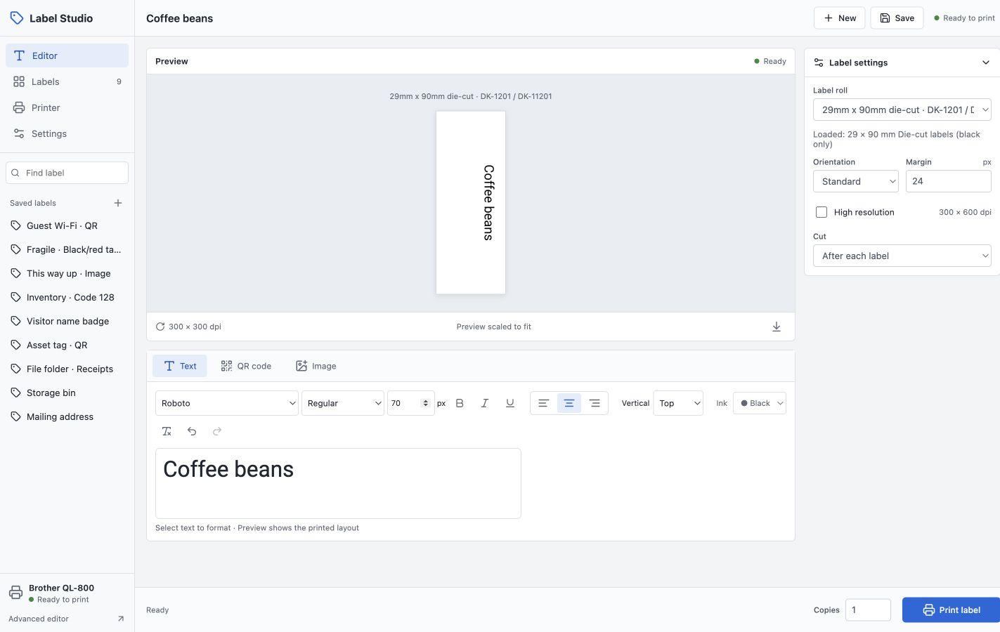
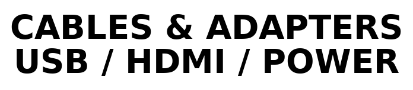
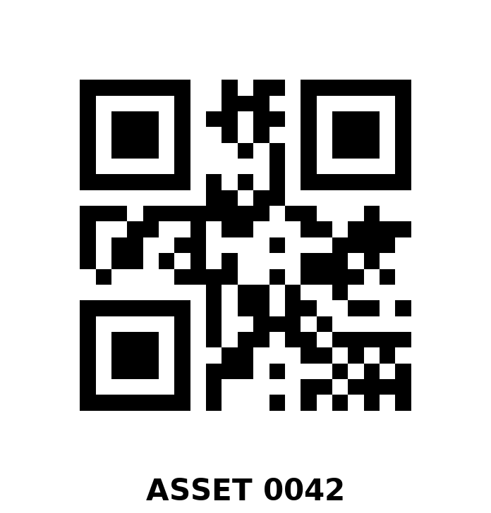
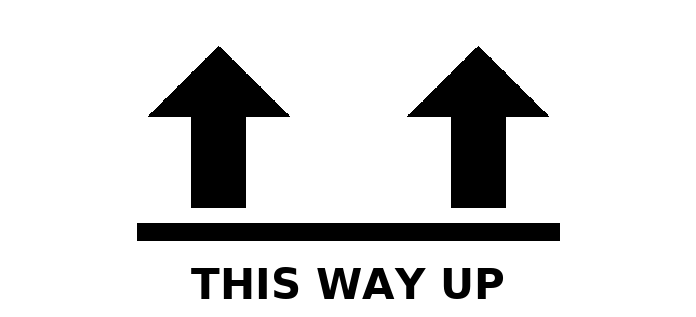
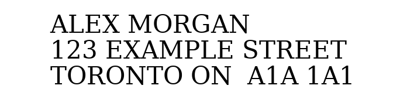
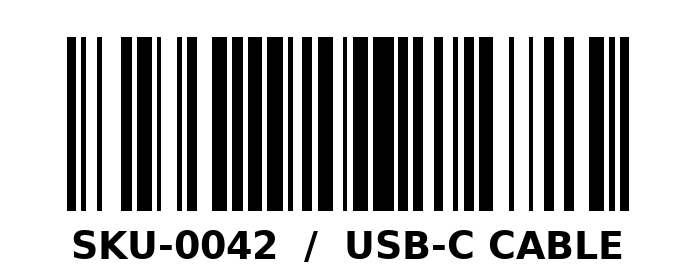
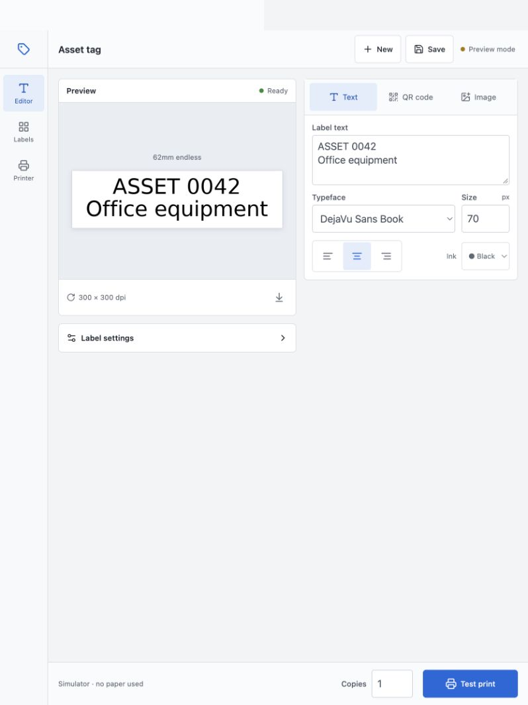
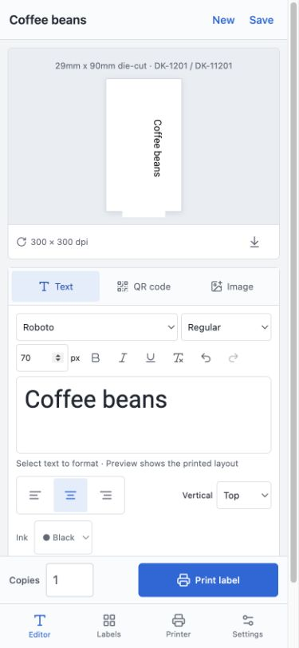

# Label Studio for Brother QL

A compact React interface for a shared Brother label printer. Desktop toolbar and saved-label sidebar, a touch layout for tablets, and a phone editor with a fixed print bar. Flask serves the built interface and handles rendering and printing; no Node server runs on the printer host.

**Development preview.** A native deployment on a 32-bit Raspberry Pi 3 is running with the QL-800 detected and ready. Renderer, storage, and USB tests pass on the Pi; physical print quality and optional hardware modes still need user validation. [Deployment and rollback](deploy/README.md).



[Setup and development](STUDIO.md) · [Migration and tradeoffs](docs/migration.md) · [QL-800 power settings](docs/ql800.md) · [Design mockup](docs/design/app-mockup.png)

## Linux auto power-off

The experimental [QL-800 settings utility](docs/linux-power-settings.md) can read and disable Auto Power Off directly through Linux USB. A real QL-800 accepted a change from 60 minutes to disabled and returned the new value. Idle-period behavior and persistence after a power cycle remain to be tested. No Mac/Windows tool or firmware replacement was used.

## Ready-to-print samples

First installs include nine examples: storage bin, asset QR tag, handling arrows, mailing address, file folder, visitor badge, inventory barcode, guest Wi-Fi QR, and a red Fragile label. Eight use standard 62 mm tape; Fragile is saved for 62 mm black/red tape. The QR encodes the sample identifier `ASSET-0042`. Open one from Labels, edit if needed, and print. The mailing address and Wi-Fi credentials are placeholders. The inventory barcode is a fixed image encoding `SKU-0042`; editing its caption does not change the barcode. Use the advanced editor to generate a different linear barcode. Samples are created once; deleted samples stay deleted and existing libraries are preserved.

| Text | QR | Image |
| --- | --- | --- |
|  |  |  |

The additional examples take inspiration from the common uses on [Brother’s QL-800 product page](https://www.brother.ca/en/p/QL800), using original artwork and sample content.

| Mailing address | Visitor badge | Inventory barcode |
| --- | --- | --- |
|  |  |  |

The compact **Fragile · Black/red tape** sample has an original broken-glass icon
and red lettering. Its roll, orientation, margins, and resolution are saved with
the label. Printing on physical hardware asks you to confirm black/red tape is
loaded because the status reader cannot distinguish it from ordinary 62 mm tape.
The image is horizontal across the roll, with roughly 23 mm of rendered content
along the feed direction, plus the printer's feed/cut allowance.


## What changes

| Area | Label Studio | Classic editor, still included |
| --- | --- | --- |
| Interface | React, TypeScript, custom CSS; desktop, tablet, phone layouts | Bootstrap 5 and jQuery |
| Labels | Multiline text, QR with caption, images and first PDF page | Per-line formatting, barcodes, templates, symbol picker |
| Saved labels | Separate versioned JSON library, duplicate and quick print | Existing upstream library remains available |
| Printer | Status checks, bounded USB reads, shared printer lock, roll-size checks | Uses the same lock for physical access |
| Deployment | Build static assets, serve with Python | Available at `/labeldesigner/` |

Use `⌘/Ctrl + S` to save and `⌘/Ctrl + Enter` to print from the editor. The simulator is explicitly labeled **Test print** and uses no paper. Mobile home-screen metadata is included; installation behavior depends on the browser and origin. There is no offline printing or offline job queue.

## Upstream and license

This fork starts from [DL6ER/brother_ql_web](https://github.com/DL6ER/brother_ql_web), commit `6c88c0489eb47324371425eb0bb55be04425aed7`. DL6ER builds on [pklaus](https://github.com/pklaus/brother_ql_web), [tbnobody](https://github.com/tbnobody/brother_ql_web), [dersimn](https://github.com/dersimn/brother_ql_web), and [davidramiro](https://github.com/davidramiro/brother_ql_web). Printer communication uses [matmair/brother_ql-inventree](https://github.com/matmair/brother_ql-inventree), descended from [pklaus/brother_ql](https://github.com/pklaus/brother_ql).

The original Git history and [GPL-3.0 license](LICENSE) are retained. This is a community fork, not an official Brother product. No upstream endorsement is implied.

## Screens

The following are screenshots of the running interface. The generated [design board](docs/design/app-mockup.png) was made before implementation and includes conceptual controls that are not all implemented.

| Tablet | Phone |
| --- | --- |
|  |  |

## Verification

The `Label Studio` workflow runs the renderer/QR regression tests and frontend production build. Legacy PNG snapshot tests are retained as a manual workflow: they assume the old root route and exact historical QR artwork. Their baselines have not been regenerated to conceal intentional changes. Container publication is manual and targets the fork owner's registry.

<details>
<summary>Original upstream documentation</summary>

# brother_ql_web

[](https://github.com/DL6ER/brother_ql_web/actions/workflows/ci.yml) [](https://github.com/DL6ER/brother_ql_web/actions/workflows/codeql.yml) [](https://github.com/DL6ER/brother_ql_web/actions/workflows/devcontainer-ghcr.yml)

This is a dockerized `python3` web service to print labels on Brother QL label printers.
The web interface is [responsive](https://en.wikipedia.org/wiki/Responsive_web_design). The CI tests are run using `pytest` in the [latest version of Python](https://hub.docker.com/layers/library/python/3-alpine) for Alpine Linux.

There are a lot of forks of the `brother_ql` and `brother_ql_web` repos from [`pklaus/brother_ql`](https://github.com/pklaus/brother_ql).
This fork tries to support many more printers and provide additional features.

Additional printer support comes from [`matmair/brother_ql-inventree`](https://github.com/matmair/brother_ql-inventree) as a dependency for communicating with the printers and [`tbnobody/brother_ql_web`](https://github.com/tbnobody/brother_ql_web) as a base for the frontend as there have been a few fixes and improvements implemented over there. This fork also builds on enhancements from [`dersimn/brother_ql_web`](https://github.com/dersimn/brother_ql_web) and [`davidramiro/brother_ql_web`](https://github.com/davidramiro/brother_ql_web) for which we are grateful, too.

## Screenshots

### Barcode with text


### Label repository


### Image with auto-fit


### Supported barcodes


### Native dark mode


### Template support


### UTF-8 symbol picker


## New Features

- Automatic printer and label detection (limited detection for network printers, see below)
- Multi-printer support
- Convenient label repository (save, load, edit and print labels easily)
- Support for more printers via `brother_ql-inventree` (**new**)
  - QL-500
  - QL-550
  - QL-560
  - QL-570
  - QL-580N
  - **QL-600**
  - QL-650TD
  - QL-700
  - QL-710W
  - QL-720NW
  - QL-800
  - QL-810W
  - QL-820NWB
  - QL-1050
  - QL-1060N
  - **QL-1100**
  - **QL-1110NWB**
  - **QL-1115NWB**
- High-resolution (600dpi) printing support
- Support individual fonts/sizes and spacing for each line of text
- Dynamic content replacement using templates (e.g., `{{datetime}}`, `{{counter}}`)
- Import and export of labels in an easily editable format (JSON)
- Allow text inversion for emphasized text even without color
- Auto-fit images onto the labels to avoid cropping
- Arbitrary scaling of images with interpolation
- Arbitrary rotation of images with interpolation
- Automatic crop of images to the actual content to avoid unnecessary white space
- Support for TODO list creation (tickable checkboxes)
- Allow text together with images
- Print text as QR Code or barcode
- Support for a wide range of barcodes (CODABAR, CODE128, CODE39, EAN, EAN13, EAN13-GUARD, EAN14, EAN8, EAN8-GUARD, GS1, GS1-128, GTIN, ISBN, ISBN10, ISBN13, ISSN, ITF, JAN, NW-7, PZN, UPC, UPC-A, QR)
  - Add text to QR Code
  - Change size of QR Code
- Upload files to print
  - PDF files
  - A larger number of image formats (PNG, JPG, JPEG, GIF, WEBP, AVIF, WMF, EPS, PS, BMP, GBR, ICB, FITS, PCX, TGA, PBM, FTU, VDA, PPM, VST, ICO, CUR, AVIFS, PGM, JPX, RAS, XPM, J2K, MPEG, IM, JPE, PNM, GRIB, TIF, PXR, RGBA, JP2, PFM, FTC, JFIF, JPC, JPF, BUFR, IIM, MPG, APNG, DDS, HDF, XBM, PSD, J2C, DIB, PCD, SGI, MSP, ICNS, FIT, H5, FLC, BW, QOI, DCX, RGB, BLP, TIFF, EMF, FLI)
  - automatically convertion to black/white image
- Change print color for black/white/red labels
- Support borders (multi-color, also with rounded edges)
- Print labels multiple times
  - Cut every label
  - Cut only after the last label
- Better error handling
- Native dark mode
- A status icon indicating the current status
  - no color = idle
  - gray = busy
  - green = printing successful
  - red = error needing your attention
- Migrated GUI to Bootstrap 5
- Make preview for round labels... round
- Print images on red/black paper
- Dockerized
- Devcontainer for ease of development/contributing

### Supported templates

- `{{counter[:<start>]}}` — Inserts the current counter value (automatically increments when printing multiple labels at the same time).
- `{{datetime:<format>}}` — Inserts the current date and time, e.g. `%H:%M:%S %d.%m.%Y` (see [strftime](https://strftime.org/)).
- `{{uuid}}` — Inserts a random UUID (Universally Unique Identifier).
- `{{short-uuid}}` — Inserts a shortened version of a UUID.
- `{{env:<var>}}` — Inserts the value of the environment variable `<var>`.
- `{{random[:<len>][:shift]}}` — Inserts a random string of optional length `<len>` (defaulting to 64). The optional `shift` parameter can be used to shift the random string around to fill gaps.

## Docker Compose

You may also use the example [`docker-compose.yml`](./docker-compose.yml) file provided in this repository to quickly get started with Docker Compose:

``` yaml
services:
  brother_ql_web:
    image: ghcr.io/dl6er/brother-ql-web:latest
    # build: . # you may also build the container locally
    container_name: brother_ql_web
    restart: always
    ports:
      - "8013:8013"
    devices:
      - "/dev/usb/lp0:/dev/usb/lp0"
    volumes:
      - ./labels:/app/labels
    environment:
      - LABEL_DEFAULT_SIZE=62
      - LABEL_DEFAULT_ORIENTATION=standard
      - PRINTER_MODEL=QL-800
      - PRINTER_PRINTER=file:///dev/usb/lp0
```

Or, if you want to use automatic printer detection:

``` yaml
services:
  brother_ql_web:
    image: ghcr.io/dl6er/brother-ql-web:latest
    # build: . # you may also build the container locally
    container_name: brother_ql_web
    restart: always
    ports:
      - "8013:8013"
    privileged: true
    network_mode: host
    volumes:
      - /dev/usb:/dev/usb
      - ./labels:/app/labels
    environment:
      - LABEL_DEFAULT_SIZE=62
      - LABEL_DEFAULT_ORIENTATION=standard
      - PRINTER_MODEL=QL-800
```

The container will automatically show printers when they become available.

To build the image locally:

```bash
git clone https://github.com/DL6ER/brother_ql_web.git
cd brother_ql_web
docker compose build
```

### Usage

Once it's running, access the web interface by opening the page with your browser.
If you run it on your local machine, go to <http://localhost:8013>.
You will then be forwarded by default to the interactive web gui located at `/labeldesigner`.

All in all, the web server offers:

-   a web GUI allowing you to print your labels, and
-   an API.

### Network printer support

Network printers are supported but with some limitations regarding automatic detection and status queries. The printer status is always shown as "Network Printer" for network printers as they do not support the usual USB-based status queries. Automatic detection of network printers is done by scanning the ARP table for devices with known Brother MAC address prefixes, which may not be exhaustive. If you have a Brother network printer that is not detected automatically, you can still add it manually by specifying its IP address in the printer configuration (e.g., `tcp://<IP_ADDRESS>`). Please also open an issue if you have a Brother network printer that is not detected automatically so that we can integrate detection for this model.

### API

All functionality of the web interface is also available via a REST API. Currently, the API is not documented in a separate documentation but can be explored using the web interface when the container is running.

### Contributing / Development

To contribute to this project, follow these steps:

1. Create a [fork in your own namespace](https://github.com/DL6ER/brother_ql_web/fork)

2. Clone the repository:
   ```bash
   git clone https://github.com/<your name goes here>/brother_ql_web.git
   cd brother_ql_web
   ```

2. Make your changes and test them locally, preferably inside the convenient devcontainer.

3. Submit a pull request with a clear description of your changes.

This project offers a **Development Container** for easy local development. You can right away start coding without worrying about the environment setup using the free and open source IDE [VSCode](https://code.visualstudio.com/). Other editors may be able to utilize the provided Dockerfile for a similar setup. Note that the provided devcontainer does not mount any possibly existing local USB printers for compatibility reasons. You may want to edit `.devcontainer/devcontainer.json` to mount such local devices.

### License

This software is published under the terms of the GPLv3, see the LICENSE file in the repository.

Parts of this package are redistributed software products from 3rd parties. They are subject to different licenses:

-   [Bootstrap](https://github.com/twbs/bootstrap), MIT License
-   [Font Awesome](https://github.com/FortAwesome/Font-Awesome), CC BY 4.0 License
-   [jQuery](https://github.com/jquery/jquery), MIT License

</details>
